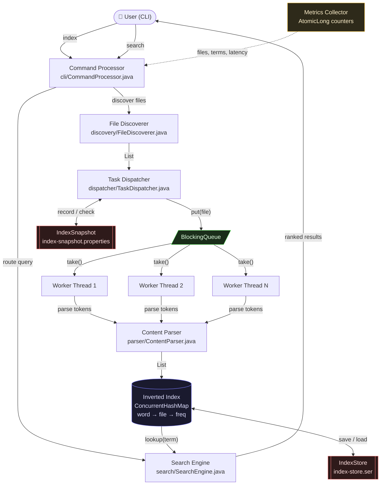

# Parallel File Search Engine

A high-performance, multithreaded file indexing and search engine built in Java 21.  
Index a codebase once — then search across thousands of files in milliseconds.

```
> search authentication
Results for authentication (4 file(s)):
  AuthService.java        (8 matches)
  LoginController.java    (3 matches)
  tokenizer.json          (2 matches)
  README.md               (2 matches)
Search latency: 3 ms
```

---

## Why this exists

Tools like `grep` re-scan every file on every query. On a large codebase that means:

- Repeated full disk reads for every search
- No ranking — results appear in filesystem order, not by relevance
- Single-threaded — can't use modern multi-core CPUs
- No memory between runs — every search starts from scratch

This engine scans files **once**, builds a persistent inverted index in parallel, and serves O(1) ranked lookups from memory on every subsequent query.

---

## Features

- **Multithreaded indexing** — configurable worker thread pool via `ExecutorService`
- **Inverted index** — word → file → frequency, enabling instant ranked search
- **Incremental indexing** — re-indexes only new or modified files on repeat runs
- **Persistent index** — full index saved to disk, restored on next startup (no re-indexing needed)
- **Phrase search** — `search "public class"` finds files containing all words
- **Extension filter** — `search jwt ext:java` limits results to a file type
- **Benchmarking** — built-in 1/2/4/8 thread comparison with speedup table
- **Metrics** — files indexed, unique terms, throughput, search latency

---

## Requirements

- **Java 21** or higher — uses `toList()`, text blocks, and switch expressions
- **Maven 3.8+**

Check your versions:
```bash
java -version
mvn -version
```

---

## Getting Started

```bash
git clone https://github.com/your-username/parallel-search-engine.git
cd parallel-search-engine
mvn compile exec:java
```

Or build and run as a JAR:
```bash
mvn package
java -jar target/parallel-search-engine-1.0-SNAPSHOT.jar
```

---

## Usage

```
index <path>           Index new/modified files only (incremental)
reindex <path>         Force re-index everything under a path
search <keyword>       Keyword search, results ranked by frequency
search "<phrase>"      Phrase search — files must contain all words
search <kw> ext:<ext>  Filter by file extension  e.g. ext:java, ext:md
stats                  Show full metrics report
benchmark <path>       Run 1/2/4/8 thread comparison benchmark
save                   Manually persist index and snapshot to disk
clear                  Wipe index from memory and disk
threads <n>            Set worker thread count (default: logical core count)
help                   Show command reference
exit                   Save and quit
```

### Example session

```
=== Parallel File Search Engine ===
Using 16 threads by default

> index D:/Projects/MyApp
Discovering files in: D:/Projects/MyApp
Found 2,847 files. Indexing with 16 thread(s)...
Indexed 2,847 files in 4.1s (694 files/sec)

> search authentication
Results for authentication (6 file(s)):
  AuthService.java          (20 matches)
  JWTProvider.java          (10 matches)
  LoginController.java       (8 matches)
  SecurityConfig.java        (4 matches)
  README.md                  (2 matches)
  application.yml            (1 match)
Search latency: 2 ms

> search "jwt token" ext:java
Results for "jwt token" ext:java (2 file(s)):
  JWTProvider.java          (25 matches)
  AuthService.java           (6 matches)
Search latency: 1 ms

> benchmark D:/Projects/MyApp
─────────────────────────────────────────────
Threads    Time (ms)    Files/sec    Speedup
─────────────────────────────────────────────
1          235          93.6         1.00x
2          154          142.9        1.53x
4          162          135.8        1.45x
8          149          147.7        1.58x
─────────────────────────────────────────────

> exit
[IndexStore] Saved 81360 terms
Goodbye.
```

---

## Architecture



### Component responsibilities

| Component | Class | Responsibility |
|---|---|---|
| Command Processor | `cli/CommandProcessor` | REPL — parses and routes all commands |
| File Discoverer | `discovery/FileDiscoverer` | Recursive directory walk, extension filtering |
| Task Dispatcher | `dispatcher/TaskDispatcher` | Owns thread pool and blocking queue |
| Content Parser | `parser/ContentParser` | Tokenizes raw text — lowercase, strip punctuation |
| Inverted Index | `index/InvertedIndex` | Core data structure: word → file → frequency |
| Search Engine | `search/SearchEngine` | Keyword, phrase, and filtered search with ranking |
| Index Store | `index/IndexStore` | Serializes full index to disk, restores on startup |
| Index Snapshot | `index/IndexSnapshot` | Tracks file timestamps for incremental indexing |
| Metrics Collector | `metrics/MetricsCollector` | Lock-free performance counters via `AtomicLong` |

---

## Concurrency Design

### Threading model

```
Producer (File Discoverer)
          │
          │  put(filePath)     ← blocks when queue full (natural backpressure)
          ▼
  BlockingQueue<Path>
          │
          │  take()
    ┌─────┴─────┐
    ▼           ▼
Worker 1    Worker 2  ...  Worker N
    │           │
    └─────┬─────┘
          ▼
   InvertedIndex (ConcurrentHashMap)
```

One producer discovers files and feeds a `LinkedBlockingQueue`. N worker threads drain it concurrently, parse content, and update the shared index. Queue capacity is `2 × threadCount` — this creates backpressure so the producer never outpaces workers and exhausts memory.

### Why each class was chosen

**`ExecutorService`** — manages the worker pool with a fixed thread count. Workers are reused across files; no thread-per-file overhead. Shutdown is coordinated via poison pills — one sentinel `Path` value per worker signals it to stop cleanly.

**`BlockingQueue`** — decouples the producer from consumers without explicit locking. `put()` blocks when full; `take()` blocks when empty. All producer-consumer synchronization is handled by the queue itself.

**`ConcurrentHashMap`** — allows concurrent writes from multiple workers without a global lock. Individual map segments are locked independently, so contention scales with the number of distinct keys (words) rather than the number of threads. `merge()` and `computeIfAbsent()` provide atomic per-key updates.

**`AtomicLong`** — lock-free counters for metrics using hardware compare-and-swap. No synchronization cost for tracking files processed, terms indexed, or latency.

---

## Incremental Indexing

After each index run, every file's last-modified timestamp is saved to `index-snapshot.properties`. On the next `index` call:

1. Files whose timestamps are unchanged are **skipped entirely**
2. Modified files are **evicted from the index** then re-indexed
3. Deleted files are **removed** from both the index and snapshot

```
First run:    22 files indexed in 303 ms
Second run:   Index is up to date. No files changed.
Third run:    1 new/modified file — indexed in 72 ms
```

---

## Persistent Index

The full inverted index is serialized to `index-store.ser` on exit. On the next startup it is deserialized and ready to search — no re-indexing required.

```
[IndexStore] Loaded 81360 terms from index-store.ser
> search authentication       ← works immediately, zero indexing
Results for authentication (4 file(s)):
  ...
Search latency: 3 ms
```

---

## Supported File Types

```
.java  .py   .js   .ts   .cpp  .c    .h
.md    .txt  .json .xml  .yml  .yaml
```

Skipped automatically: `.exe` `.dll` `.class` `.jar` `.png` `.jpg` `.gif` `.mp4`

---

## Benchmark Results

Tested on a 22-file Java project (210,928 total terms, 81,360 unique terms).  
Hardware: Windows, 16 logical cores.

| Threads | Time (ms) | Files/sec | Speedup |
|---------|-----------|-----------|---------|
| 1       | 235       | 93.6      | 1.00x   |
| 2       | 154       | 142.9     | 1.53x   |
| 4       | 162       | 135.8     | 1.45x   |
| 8       | 149       | 147.7     | 1.58x   |

> The benchmark above was performed on a small 22-file project.Larger repositories are expected to benefit more from parallel indexing, although additional benchmarking remains future work.

>The benchmark highlights a common concurrency tradeoff:
for small datasets, thread scheduling and synchronization overhead can offset the benefits of parallelism.


The architecture is designed for larger repositories where file processing work dominates coordination costs.

---

## Complexity Analysis

| Operation | Complexity |
|------------|------------|
| Index Lookup | O(1) average |
| Keyword Search | O(k log k) |
| File Discovery | O(n) |
| Index Construction | O(total terms) |

Where:

- n = number of indexed files
- k = number of matching files

## Engineering Challenges

### Concurrent Index Updates

Multiple worker threads may encounter the same word simultaneously.

To prevent race conditions, the index uses ConcurrentHashMap together with atomic update operations such as merge() and computeIfAbsent().

### Thread Pool Sizing

Benchmarking showed that increasing thread count does not always improve performance.

For small datasets, thread scheduling and synchronization overhead can reduce expected speedup.

## Project Structure

```
src/main/java/com/fileSearch/
├── Main.java
├── cli/
│   └── CommandProcessor.java      REPL and command routing
├── discovery/
│   └── FileDiscoverer.java        Recursive file walker
├── dispatcher/
│   └── TaskDispatcher.java        Thread pool + blocking queue
├── parser/
│   └── ContentParser.java         Tokenizer
├── index/
│   ├── InvertedIndex.java         Core data structure
│   ├── IndexStore.java            Disk persistence
│   └── IndexSnapshot.java         Incremental indexing state
├── search/
│   └── SearchEngine.java          Keyword, phrase, ext: search
├── metrics/
│   └── MetricsCollector.java      Lock-free performance counters
└── model/
    └── SearchResult.java          Result DTO with Comparable ranking
```

---

## Running Tests

```bash
mvn test
```

30 tests across Parser, InvertedIndex, keyword search, phrase search, and ext: filtering.

---

## Generated Files

Two files are created in your working directory after the first index run:

| File | Purpose |
|---|---|
| `index-store.ser` | Serialized inverted index — restored on next startup |
| `index-snapshot.properties` | File timestamps for incremental indexing |

Both are listed in `.gitignore` and should not be committed.

---

## .gitignore

Add these lines to your `.gitignore`:

```
index-store.ser
index-snapshot.properties
target/
```

---

## Contributing

Contributions are welcome. Some areas that could be extended:

- CamelCase token splitting (`AuthService` → `auth` + `service`)
- Multi-keyword AND/OR search (`auth AND jwt`)
- Persistent index using an embedded database (RocksDB, H2)
- Class and method name detection for code intelligence

To contribute: fork the repo, create a feature branch, and open a pull request.

---

## License

MIT License — see [LICENSE](LICENSE) for details.

```
Copyright (c) 2025 Sukruta

Permission is hereby granted, free of charge, to any person obtaining a copy
of this software and associated documentation files (the "Software"), to deal
in the Software without restriction, including without limitation the rights
to use, copy, modify, merge, publish, distribute, sublicense, and/or sell
copies of the Software, and to permit persons to whom the Software is
furnished to do so, subject to the following conditions:

The above copyright notice and this permission notice shall be included in all
copies or substantial portions of the Software.

THE SOFTWARE IS PROVIDED "AS IS", WITHOUT WARRANTY OF ANY KIND, EXPRESS OR
IMPLIED, INCLUDING BUT NOT LIMITED TO THE WARRANTIES OF MERCHANTABILITY,
FITNESS FOR A PARTICULAR PURPOSE AND NONINFRINGEMENT.
```